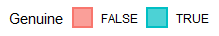

# Introduction
The Swiss Bank dataset contains several measures that were collected from 100 genuine and 100 counterfeit old-Swiss bank notes. In this study, I aim to explore whether we can use those collected measures to distinguish the genuine Swiss notes from the counterfeit Swiss notes. More specifically, I will use both Linear Discriminant Analysis (LDA) and Logistic Regression (LR) to conduct the classification tasks, and compare their performances. Then, dimension reduction techniques (i.e. Factor Analysis using Maximum Likelihood Estimation) will be applied to the Swiss note measures to reduce the features into a smaller amount of dataset, which will be further fed into LDA and LR model to see if there's a difference in the performance. Such a model, for example, could be used to detect whether an old-Swiss bank note is genuine or counterfeit without the use of more sophisticated technical equipments. 

# Tasks & Analysis 
The following is the packages that are needed in this report

```{r message=FALSE, warning=FALSE}
library(tidyverse)
library(lattice)
library(ellipse)
library(gridExtra)
library(grid)
library(MASS)
library(rstatix)
```

## Dataset
The data set contains six measurements made on 100 genuine and 100 counterfeit old-Swiss 1000-franc bank notes. The six measures includes length of the note (mm), width of the Left-Hand side of the note (mm), width of the Right-Hand side of the note (mm), width of the Bottom Margin (mm), width of the Top Margin (mm), and diagonal Length of Printed Area (mm). It is adopted from Flury, B. and Riedwyl, H. (1988). Multivariate Statistics: A practical approach. London: Chapman & Hall, Tables 1.1 and 1.2, pp. 5-8. I extracted the dataset from https://github.com/tuckermcelroy/ma189/blob/main/Data/SBN.txt at 2021-03-15 00:09:58 PST.

The following code is used to load and clean the dataset.

```{r message=FALSE, warning=FALSE}
swissBank <- read.table("Data/SBN.txt") %>%
  mutate(Genuine = c(rep(TRUE, 100), rep(FALSE, 100))) %>% 
  rename(`Note Length` = Length, `Left Margin` = Left, 
         `Right Margin` = Right, `Bottom Margin` = Bottom,
         `Top Margin` = Top, `Diagonal Length` = Diagonal)
glimpse(swissBank)
```

## Method 
Level plots will first be used to see if there's any significant relationship between two or more features that we need to take a note of. Then, density plots + box plots will be used to see if there's any visually signifcant difference in the distribution of each measure. This way, we can decide which feature we should and which feature we should not include in the classification model. Then, two machine learning classification techniques, Linear Discriminant Analysis (LDA) and Logistic Regression (LR), will be applied to the six measures (or selected measures based on the visualizations) to perform a classification task. Prediction accuracy will be the measure for performance in this study. And a 5-fold cross-validation method will be used to assess the models. 

Since (from common knowledge and the level plot below) that length/width measures of the same note will definitely be highly associated, a dimensionality reduction method (Factor Analysis using Maximum Likelihood Estimation (MLE)) will be applied to reduce the dimension of features from six to lower. Then, the dimension-reduced factors will be fed into LDA and LR models again to see if there's a significant difference between models using different features. A report containing different models


## Analysis
The followings are some functions that are created for repeated usage in the report. As you can see, function `panel.corrgram()` is used to plot level plots. Function `graphs()` is used to plot density plots and box plots. Function `k.fold.split()` is used to split data into k-folds. Function `model.aucs()` is used to calculate and LDA and LR train/valid accuracies across k-folds. Function `output()` is used to nicely & systematiclly print out desired outputs.

```{r}
# function to plot level plot
panel.corrgram <- function(x, y, z, subscripts, at, level = 0.9, label = FALSE, ...) {
     require("ellipse", quietly = TRUE)
     x <- as.numeric(x)[subscripts]
     y <- as.numeric(y)[subscripts]
     z <- as.numeric(z)[subscripts]
     zcol <- level.colors(z, at = at,  ...)
     for (i in seq(along = z)) {
       ell=ellipse(z[i], level = level, npoints = 50, 
                   scale = c(.2, .2), centre = c(x[i], y[i]))
       panel.polygon(ell, col = zcol[i], border = zcol[i], ...)
       }
     if (label){ 
       panel.text(x = x, y = y, lab = 100 * round(z, 2), cex = 0.8,
                  col = ifelse(z < 0, "white", "black"))
       }
}

# function to plot density plots & box plots
graphs <- function(colName){
  bin_width = round(diff(range(swissBank[[colName]]))/15,5)
  # plot histogram with density
  hist <- swissBank %>% 
    ggplot(aes(x = .data[[colName]])) +
    geom_histogram(aes(y=..density.., fill = Genuine), 
                   position = 'identity', bins = 15, alpha = 0.5) +
    geom_density(aes(color = Genuine), position = 'identity', 
                 bw = bin_width, size = 1, alpha = 0.4)+
    labs(
      x = paste(colName, "(mm)"),
      y = "Density"
    ) + 
    theme_bw() +
    theme(legend.position = "none",
          panel.grid = element_blank(),
          axis.title = element_text(size=10))
  
  # plot boxplot
  box <- swissBank %>% 
    ggplot(aes(x = Genuine, y = .data[[colName]], 
               color = Genuine, fill = Genuine)) +
    geom_boxplot(alpha = 0.5) +
    labs(
      x = "Genuine",
      y = paste(colName, "(mm)")
    ) + 
    theme_bw() +
    theme(legend.position = "none",
          panel.grid = element_blank(),
          axis.title = element_text(size=10))
  
  # return the graphs
  grid.arrange(hist, box, nrow = 1, 
               top = textGrob(paste("Density & Boxplot of", colName), 
                              gp=gpar(fontsize=16, face = "bold", font = 2)))
}

# function to split dataset into k-folds
k.fold.split <- function(k) {
  gen.ind <- sample(1:100, 100) # random indices
  count.ind <- sample(101:200, 100) # random indices
  gen.sets <- split(gen.ind, cut(seq_along(gen.ind), k, labels = F))
  count.sets <- split(count.ind, cut(seq_along(count.ind), k, labels = F))
  
  # concatenate equal length of genuine & counterfeit
  sets <- list()
  for (i in 1:k) {
    sets[[i]] <- c(gen.sets[[i]], count.sets[[i]])
  }
  sets
}

# function to calculate k-fold LDA/LR model accuracy
model.aucs <- function(k, folds, var.cols, LDA.model, LR.model) {
  # start cross-validation
  LDA.train.aucs <- rep(NA, k)
  LDA.valid.aucs <- rep(NA, k)
  LR.train.aucs <- rep(NA, k)
  LR.valid.aucs <- rep(NA, k)
  for (i in 1:k) {
    train.set <- swissBank[-folds[[i]],]
    valid.set <- swissBank[folds[[i]],]
    train.var <- train.set[var.cols]
    valid.var <- valid.set[var.cols]
    
    # get LDA predicted class
    LDA.train.pred <- predict(LDA.model, train.var)$class
    LDA.valid.pred <- predict(LDA.model, valid.var)$class
    
    # get LR probability: if p >= 0.5, predict cancel; if p < 0.5, predict not cancel
    LR.train.pred <- predict(LR.model, train.var, type = "response") >= 0.5
    LR.valid.pred <- predict(LR.model, valid.var, type = "response") >= 0.5
    
    # get accuracy rate, defined as the proportion of correct prediction
    LDA.train.aucs[i] <- mean(LDA.train.pred == train.set$Genuine)
    LDA.valid.aucs[i] <- mean(LDA.valid.pred == valid.set$Genuine)
    LR.train.aucs[i] <- mean(LR.train.pred == train.set$Genuine)
    LR.valid.aucs[i] <- mean(LR.valid.pred == valid.set$Genuine)
  }
  list("LDA Train" = LDA.train.aucs, "LDA Valid" = LDA.valid.aucs,
       "LR Train" = LR.train.aucs, "LR Valid" = LR.valid.aucs)
}

# function to produce outputs
output <- function(LDA.model, LR.model, pred.acc) {
  acc.table <- t(c(mean(pred.acc[[1]]), mean(pred.acc[[2]]), 
                 mean(pred.acc[[3]]), mean(pred.acc[[4]])))
  colnames(acc.table) <- names(pred.acc)
  rownames(acc.table) <- "Prediction Accuracy"
  
  list("LDA Linear Discriminants" = LDA.model$scaling,
       "LR Coefficients" = summary(LR.model)$coefficients,
       "Prediction Accuracies" = acc.table)
}
```

### Visualization
To start, it's good to visualize the relationships between the six variables in the dataset.

#### Level plot
I first use a level plot to examine the linear relationship/association between the six variables.

```{r fig1, fig.height=4.8, fig.width=8, fig.align='center'}
cor_feature = cor(swissBank[1:6]) #correlation matrix of dataset
print(levelplot(cor_feature[seq(6,1), seq(6,1)], at = do.breaks(c(-1.01, 1.01), 20), xlab = NULL, 
                ylab = NULL, colorkey = list(space = "top"), panel = panel.corrgram, label = TRUE,
                col.regions=rev(heat.colors(100)), scales = list(x = list(rot = 90))))
```

From the level plot, we can see that Left Margin and Right Margin are highly positively correlated with each other($r = 0.74$). Left margin also correlates with top margin ($r = 0.36$) and bottom margin ($r = 0.41$), and right margin also correlates with top margin ($r = 0.40$) and bottom margin ($r = 0.49$). Also note that diagonal length of the Swiss note is highly negatively correlated with almost all measures ($r < -0.5$) except note length ($r = 0.19$). This finding makes sense because the diagonal length is measured across the whole note, which contains top/bottom/left/right margins.

### Histogram & Boxplot
Density plots and box plots are then used to examine the distributions of each variable across two different note status.

Each color below in graphs represents a Swiss note status as shown in the picture below.



```{r fig2, fig.height=3.1, fig.width=8, fig.align='center'}
nl <- graphs("Note Length") # density & boxplot of note length
lh <- graphs("Left Margin") # density & boxplot of left margin
rh <- graphs("Right Margin") # density & boxplot of right margin
bm <- graphs("Bottom Margin") # density & boxplot of bottom margin
tm <- graphs("Top Margin") # density & boxplot of top margin
dl <- graphs("Diagonal Length") # density & boxplot of diagonal
```

From the density and box plots above, we can see that note length does not seem to differ a lot across genuine and counterfeit groups. The left and right margins show some differences across two groups, but the difference does not seem significant. The most significant differences in distributions seem to lie in top margin, bottom margin, and diagonal length.

### Assumption check
#### LDA Assumption
For LDA, we need to assume that in population $k$, the random variable $\underline{X}$ is multivariate normal with mean $\underline{\mu}^{(k)}$ and common covariance matrix ${\mathbf \Sigma}$.

The following code is used for test for multivariate normal.

```{r}
swissBank[1:6] %>% mshapiro_test()
```

The multivariate Shapiro-Wilk's test for normality above ($p<0.001$) suggests that the data are NOT multivariate normally distributed. Even though I would still continue to conduct LDA, I would need to keep in mind that the data is not multivariate normal, and the results might not be as reliable.

Note that since the data failed the multivariate normality check, the statistical testing for homoskedasticity may not be reliable anymore since homogeneity tests for covariances (e.g. Box’s M-test) are based on the fact that the data is multivariate normally distributed. Thus, I only assumed that the covariance would be homogeneous across each group just to continue my analysis. But I would keep in mind that the dataset might have heteroskedastic problem, thus rendering an unreliable result.

#### LR Assumption
For LR, we need to assume that $(Y_1, \underline{X}_1),\ldots,(Y_n,\underline{X}_n)$ are identically and independently distributed. However, as we can see from the level plot (and common knowledge), the measures in the dataset are definitely NOT independently distributed. Most variables are moderately correlated with at least one or sometimes even more of other variables.

#### MLE Factor Analysis Assumption
For maximum likelihood estimation, we need to assume that the data is identically and independently distributed. However, just like the explanation above for LR assumption, the measures in the dataset are definitely NOT independently distributed.

### Classification Task - Normal Features
#### Split dataset
The dataset is then split into training/validation set to perform a 5-fold cross-validation. I decide on a 5-fold cross-validation because there are only 200 data points in total, and doing a cross-validation more than 5-fold would lead to a really small validation set. The splitted data are then fed into LDA and LR models to perform a classification task.

```{r message=FALSE, warning=FALSE}
k <- 5
folds <- k.fold.split(k) # split data
```

#### Full Model
Contains all the six measures: `Note Length`, `Left Margin`, `Right Margin`, `Bottom Margin`, `Top Margin`, and `Diagonal Length`.

```{r message=FALSE, warning=FALSE}
LDA.full.mdl <- lda(Genuine ~ ., data = swissBank)
LR.full.mdl <- glm(Genuine ~ ., data = swissBank, family = binomial(), maxit = 100)
full.model.vars <- c("Note Length", "Left Margin", "Right Margin", 
                     "Bottom Margin", "Top Margin", "Diagonal Length")
full.accuracies <- model.aucs(k, folds, full.model.vars, LDA.full.mdl, LR.full.mdl)
output(LDA.full.mdl, LR.full.mdl, full.accuracies)
```

Training and validation accuracy are almost the same for LDA and LR model, with sometimes LR model performing slightly better than LDA model. However, none of the measures seem to significantly predict the status of the Swiss note. This could potentially be caused by *multicollinearity* problem introduced by the high correlation between some of the variables, such as top & bottom margin, but especially, diagonal length with almost all other measures. Thus, I decide to exclude `Diagonal Length` for the next model, and only include all other five measures.

#### No Diagonal Model
Contains five measures: `Note Length`, `Left Margin`, `Right Margin`, `Bottom Margin`, and `Top Margin`.

```{r message=FALSE, warning=FALSE}
LDA.noDiag.mdl <- lda(Genuine ~ `Note Length` + `Left Margin` + `Right Margin`+ `Bottom Margin` + 
                        `Top Margin`, data = swissBank)
LR.noDiag.mdl <- glm(Genuine ~ `Note Length` + `Left Margin` + `Right Margin`+ `Bottom Margin` + 
                       `Top Margin`, data = swissBank, family = binomial(), maxit = 100)
noDiag.model.vars <- c("Note Length",  "Left Margin", "Right Margin", "Bottom Margin", "Top Margin")
noDiag.accuracies <- model.aucs(k, folds, noDiag.model.vars, LDA.noDiag.mdl, LR.noDiag.mdl)
output(LDA.noDiag.mdl, LR.noDiag.mdl, noDiag.accuracies)
```

The LR model is still performing slightly better on average than the LDA model. But comparing with the full model, the performance of both LDA and LR decreases. Then, I decide to include only the significant variables (when predicting status of Swiss note ($p<0.05$)) to see how would that change the prediction accuracy.

#### Signficaint/Essential Feature Model
Contains only two significant measures: `Bottom Margin` and `Top Margin`.

```{r message=FALSE, warning=FALSE}
LDA.essen.mdl <- lda(Genuine ~ `Bottom Margin` + `Top Margin`, data = swissBank)
LR.essen.mdl <- glm(Genuine ~ `Bottom Margin` + `Top Margin`, data = swissBank, 
                    family = binomial(), maxit = 100)
essen.model.vars <- c("Bottom Margin", "Top Margin")
essen.accuracies <- model.aucs(k, folds, essen.model.vars, LDA.essen.mdl, LR.essen.mdl)
output(LDA.essen.mdl, LR.essen.mdl, essen.accuracies)
```

Again, LR model does a better job than LDA model on average. But comparing with the No Diagonal Model that uses all variables except the `Diagonal Length`, the Essential Feature Model seems to have similar accuracy rate, which suggests that other three variables (`Note Length`, `Left Margin`, `Right Margin`) do not produce significant difference on predicting the status.

After exploring the models without the `Diagonal Length` column, I also would like to see how `Diagonal Length` alone would perform at the classification task given that it is correlated with almost all other variables.

#### Only Diagonal Model
Contains only one measure: `Diagonal Length`.

```{r message=FALSE, warning=FALSE}
LDA.diag.mdl <- lda(Genuine ~ `Diagonal Length`, data = swissBank)
LR.diag.mdl <- glm(Genuine ~ `Diagonal Length`, data = swissBank, family = binomial(), maxit = 100)
diag.model.vars <- c("Diagonal Length")
diag.accuracies <- model.aucs(k, folds, diag.model.vars, LDA.diag.mdl, LR.diag.mdl)
output(LDA.diag.mdl, LR.diag.mdl, diag.accuracies)
```

Surprisingly, it seems that the Diagonal Model beats all the other models (except full model) in its performance. This really fits our ideal parsimonious classification model, which uses the least number of features/resources to do its job.

### Factor Analysis
Since most measures are highly correlated, MLE factor analysis is also applicable since it reduces the dimensions of the data when the features are correlated with each other.

The followings are codes that fit the MLE factor analysis (with the factor scores output available).

```{r message=FALSE, warning=FALSE}
n.factors <- 3 # highest number of factors applicable to the data
fact.fit <- factanal(swissBank[1:6], n.factors, rotation="varimax", scores="regression") # MLE
print(fact.fit$loadings, cutoff=.001) # prop of var & loading

fact.scores <- fact.fit$scores
swissBank <- swissBank %>% 
  mutate(Factor1 = fact.scores[,1], Factor2 = fact.scores[,2], Factor3 = fact.scores[,3])
```

#### Scree Plot
I then constructed the output information above into a scree plot and a cumulative proportion plot for easier visualization of how well the factors explain the data.

```{r fig3, fig.height=6, fig.width=7, fig.align='center'}
par(mfrow = c(2,1)) # format the graphs
mle_pve <- c(0.265, 0.254, 0.184)
# scree plots & cumulative proportion plot
plot(mle_pve, xlab="MLE Factor", col="blue", xaxt="n", 
     ylab="Prop of Variance Explained", ylim=c(0,1), type='b', pch=20)
axis(1, at=c(1,2,3), labels=c(1,2,3))
plot(cumsum(mle_pve), xlab="MLE Factor", col="blue", xaxt="n", 
     ylab="Cum Prop of Variance Explained", ylim=c(0,1), type='b', pch=20)
axis(1, at=c(1,2,3), labels=c(1,2,3))
```

From the plot above, we can see that three factors seem to explain similar amount of variance of the data. Thus, even though the first and second factor already explains more than 50% of the data together, I still want to see how including the third factor might also add to the classification model.

#### Level Plot
After storing the factor scores into the dataframe, I also plotted out a level plot to see the correlation between the three factors.

```{r fig4, fig.height=4.8, fig.width=8, fig.align='center'}
cor_factor = cor(swissBank[8:10]) #correlation matrix of dataset
print(levelplot(cor_factor[seq(3,1), seq(3,1)], at = do.breaks(c(-1.01, 1.01), 20), xlab = NULL, 
                ylab = NULL, colorkey = list(space = "top"), panel = panel.corrgram, label = TRUE,
                col.regions=rev(heat.colors(100)), scales = list(x = list(rot = 90))))
```

As you can see, none of the variables are highly correlated with the other variables, thus I can proceed with confidence into the classification task.

### Classification Task - Factor Analysis
#### Three-Factor Model
Contains all three factors: `Factor1`, `Factor2`, and `Factor3`.

```{r message=FALSE, warning=FALSE}
LDA.fact3.mdl <- lda(Genuine ~ Factor1 + Factor2 + Factor3, data = swissBank)
LR.fact3.mdl <- glm(Genuine ~ Factor1 + Factor2 + Factor3, data = swissBank, 
                    family = binomial(), maxit = 100)
fact3.model.vars <- c("Factor1", "Factor2", "Factor3")
fact3.accuracies <- model.aucs(k, folds, fact3.model.vars, LDA.fact3.mdl, LR.fact3.mdl)
output(LDA.fact3.mdl, LR.fact3.mdl, fact3.accuracies)
```

#### Two-Factor Model
Contains the first two factors: `Factor1` and `Factor2`.

```{r message=FALSE, warning=FALSE}
LDA.fact2.mdl <- lda(Genuine ~ Factor1 + Factor2, data = swissBank)
LR.fact2.mdl <- glm(Genuine ~ Factor1 + Factor2, data = swissBank, family = binomial(), maxit = 100)
fact2.model.vars <- c("Factor1", "Factor2")
fact2.accuracies <- model.aucs(k, folds, fact2.model.vars, LDA.fact2.mdl, LR.fact2.mdl)
output(LDA.fact2.mdl, LR.fact2.mdl, fact2.accuracies)
```

#### One-Factor Model
Contains only one factor: `Factor1` (because it explains the most proportion of variance alone).

```{r message=FALSE, warning=FALSE}
LDA.fact1.mdl <- lda(Genuine ~ Factor1, data = swissBank)
LR.fact1.mdl <- glm(Genuine ~ Factor1, data = swissBank, family = binomial(), maxit = 100)
fact1.model.vars <- c("Factor1")
fact1.accuracies <- model.aucs(k, folds, fact1.model.vars, LDA.fact1.mdl, LR.fact1.mdl)
output(LDA.fact1.mdl, LR.fact1.mdl, fact1.accuracies)
```

Comparing the three models using factor scores from MLE factor analysis, it seems that the Three-Factor Model and the Two-Factor Model both do a similarly great job at the classification task with LR, again, performing slightly better than LDA on average. Even though only the One-Factor Model is significantly predicting the status, it does not do a great job comparing with all other models (all other models have accuracy rates higher than 0.95, while the One-Factor Model has accuracy rates lower than 0.90).

### Summary
A summary table of how well each model do on the classification task is printed below.

```{r}
all.sum <- c()
for (aucs in list(full.accuracies, noDiag.accuracies, essen.accuracies, diag.accuracies, 
                  fact3.accuracies, fact2.accuracies, fact1.accuracies)) {
  all.sum <- rbind(all.sum, c(aucs[[2]], mean(aucs[[2]])))
  all.sum <- rbind(all.sum, c(aucs[[4]], mean(aucs[[4]])))
  }
colnames(all.sum) <- c("Fold 1", "Fold 2", "Fold 3", "Fold 4", "Fold 5", "5-Fold Mean")
rownames(all.sum) <- c("LDA Full Model", "LR Full Model", "LDA noDiag Model", "LR noDiag Model", 
                       "LDA Essen Model", "LR Essen Model","LDA Diag Model", "LR Diag Model", 
                       "LDA 3-Factor Model", "LR 3-Factor Model", "LDA 2-Factor Model", 
                       "LR 2-Factor Model", "LDA 1-Factor Model", "LR 1-Factor Model")
all.sum
```

# Conclusion & Discussion
From the summary table above, we can see than on average, LR models seem to perform better than LDA models at predicting whether a Swiss note is genuine or counterfeit. However, other than the One-Factor Model, all the other models seem to have a really high accuracy rates with the highest being 100% at predicting the status. However, since we want the model to be parsimonious, the Diagonal Model is probably the best among all the models, since it only uses one feature to do the classification task and have achieved an accuracy rates that's similar to those using more or all features.

This has implication in real life, because imagine that you can just detect the whether a Swiss note is genuine based on the length of the diagonal. That would be super convenient and easy to do without using high-tech machines to help with the process.

However, methodologically speaking, the data seem to violate all assumption of LDA, LR and Factor Analysis. Even though these analyses are relatively robust, we cannot eliminate the possibility that the data might be biased or skewed. Also, we have to keep in mind that there's only 200 data points included in this model, and the size of the training and validation sets are relative small. Thus, the dataset might not be representative of the whole population of the Swiss note. Also, the data were collected in 1988 on old-Swiss bank note, which means that Swiss has already updated their notes. Therefore, this model might probably note apply to the current notes anymore. Collecting more data on the current Swiss note is necessarily to validate whether out model is useful or not. 

Also, since this paper only uses LDA and LR as the classification methods, future studies, after collecting more current Swiss note samples, could also use other classification methods such as support vector machine, decision trees, etc. to compare the performances of several classification methods.

# Appendix
## The Linear Discriminant Analysis (LDA)
The following is adapted from lecture 13 and lecture 14.

### What is LDA?
- Given a training dataset, we can estimate the linear discriminant function by:
\[
  \widehat{d}_k^L (\underline{x}) = 
  - \frac{1}{2}  {  \overline{\underline{x}}^{(k)}}^{\prime} \,
   {\mathbf S}^{-1} { \overline{\underline{x}}^{(k)} } 
   +   {  \overline{\underline{x}}^{(k)} }^{\prime} \,
   {\mathbf S}^{-1} { \underline{x}  }  + \log p_k
\]
where  $\overline{\underline{x}}^{(k)}$ is the sample mean of group $k$, and ${\mathbf S}$ is the pooled sample covariance matrix.
- This is a function of the sample mean vectors, the pooled covariance matrix, and prior probabilities for $g$ different populations.
- The estimated linear discriminant function can also be written as a linear form:
\begin{align*}
  \widehat{d}_k^L (\underline{x}) & = \widehat{\alpha}_k + \widehat{\underline{\beta}}_k^{\prime} \underline{x} \\
   \widehat{\alpha}_k & =  - \frac{1}{2}  {  \overline{\underline{x}}^{(k)}}^{\prime} \,
   {\mathbf S}^{-1} { \overline{\underline{x}}^{(k)} } + \log p_k \\
   \widehat{\underline{\beta}}_k & =    {\mathbf S}^{-1} \, 
   {  \overline{\underline{x}}^{(k)} }^{\prime}.
\end{align*}

### Procedure for LDA
Given a training dataset which contains $g$ populations, suppose we have a new observation $\underline{x}$ that is to be classified into one of the $g$ populations, we can apply linear discriminant analysis as follows:

1. Choose priors $p_k$ for $k=1,2,\ldots, g$.
2. Calculate sample mean vectors $\overline{\underline{x}}_k$ for $k=1,2,\ldots, g$.
3. Calculate pooled sample covariance matrix
\[
 {\mathbf S}  =  \frac{1}{N-g} \sum_{k=1}^g \sum_{i=1}^{n_k} 
 {   \left( \underline{x}_i^{(k)} - 
\overline{\underline{x}}^{(k)} \right)   } 
{  \left( \underline{x}_i^{(k)} - \overline{\underline{x}}^{(k)} \right)  }^{\prime},
\]
4. Calculate coefficients
\[
  \widehat{\alpha}_k  =  - \frac{1}{2}  {  \overline{\underline{x}}^{(k)}}^{\prime} \,
   {\mathbf S}^{-1} { \overline{\underline{x}}^{(k)} } + \log p_k
\]
5. Calculate coefficients
\[
  \widehat{\underline{\beta}}_k  =    {\mathbf S}^{-1} \, 
   {  \overline{\underline{x}}^{(k)} }
\]
6. Calculate
\[
 \widehat{d}_k^L (\underline{x})  = \widehat{\alpha}_k + \widehat{\underline{\beta}}_k^{\prime} \underline{x}
\]
for $k=1,2,\ldots, g$.
7. Classify $\underline{x}$ into the group with highest value of $\widehat{d}_k^L (\underline{x})$.

## The Logistic Regression Model (LR)
The following is adapted from lecture 15 and lecture 16.

### What is LR model?

- Let Yes be $1$ and No be $0$.
- Consider the conditional probability
\[
 p(x) = {\mathbb P} [ Y = 1 \vert X = x ]
\]
- We want to model $p(x)$ using a function that gives outputs between $0$ and $1$ for all values of $x$. Many functions meet this criterion.
- In logistic regression, we use the *logistic function*.
\[
 p(x) = \frac{ \exp \{ \beta_0 + \beta_1 x \} }{ 1 +  \exp \{ \beta_0 + \beta_1 x \} }
\]
- To fit this model, we use a method called *maximum likelihood estimation*.
- Note that
\[
 \frac{p(x)}{1 - p(x)} = \exp \{ \beta_0 + \beta_1 x \}
\]
 The left-hand side is called the *odds*. 
- Values of the odds close to 0 indicate very low probabilities of default.
- Values of the odds close to $\infty$ indicate very high probabilities of default.

### How to Estimate the Regression Coefficient
Suppose we have data ${( y_i, x_i)}_{i=1}^n$. 
- Likelihood function: by model assumption, ${\mathbf P} [ y_i=1 \vert x_i] = p(x_i)$ and
${\mathbf P} [ y_i=0 \vert x_i] = 1-p(x_i)$. So the conditional "density function” of $y_i$  given $x_i$ can be written compactly as
\[
  { p(x_i)}^{y_i} { ( 1 - p(x_i))}^{1 - y_i}
\]
- The joint conditional density of $y_1, \ldots, y_n$ given $x_1, \ldots, x_n$ is
\[
  L_n (\beta_0, \beta_1) = \prod_{i=1}^n { p(x_i)}^{y_i} { ( 1 - p(x_i))}^{1 - y_i}
\]
- This is a function of $\beta_0$ and $\beta_1$, because our model assumption is that
\[
 p(x_i) = \frac{ \exp \{ \beta_0 + \beta_1 x_i \} }{ 1 +  \exp \{ \beta_0 + \beta_1 x_i \} }
\]
- The estimates $\widehat{\beta}_0$ and $\widehat{\beta}_1$ are chosen to maximize this likelihood function.
- The logistic regression model can be fitted using a statistical software package, such as `glm` in R.

## Maximum Likelihood Estimation (MLE)
The following is adapted from lecture 21 and lecture 22.

### What is MLE Factor Analysis?
- Factor Analysis is a method for modeling observed variables, and their covariance structure, in terms of a smaller number of underlying unobservable (latent) **factors**.
- Factor analysis is a very flexible dimension reduction method. It is similar to PCA, but more elaborate. In some sense, factor analysis can be considered as an "inversion” of PCA.
- In factor analysis, we model the observed variables as linear functions of the **factors**.

### How to find factors?
- Under the i.i.d normal assumption, the joint density of $\underline{x}_1, \ldots, \underline{x}_n$ is
\[
   f ( \underline{x}_1, \ldots, \underline{x}_n) = \prod_{i=1}^n f( \underline{x}_i)
    = {(2 \pi)}^{-np/2} { \det {\mathbf \Sigma}}^{-n/2}
     \, \exp \{ - \frac{1}{2} \sum_{i=1}^n {( \underline{x}_i - \underline{\mu} )}^{\prime}
      {\mathbf \Sigma}^{-1} ( \underline{x}_i - \underline{\mu } ) \}.
\]
- Then, the log-likelihood function of $\underline{\mu}$, ${\mathbf L}$, and ${\mathbf \Psi}$ is (up to a constant, which we can ignore)
\[
 \ell_n ( \underline{\mu}, {\mathbf L}, {\mathbf \Psi})
 = - \frac{n}{2} \log \det [  {\mathbf L} \,  {\mathbf L}^{\prime}    +  {\mathbf \Psi} ]
  - \frac{1}{2}  \sum_{i=1}^n {( \underline{x}_i - \underline{\mu} )}^{\prime}
       { ( {\mathbf L} \,  {\mathbf L}^{\prime}    +  {\mathbf \Psi} ) }^{-1} 
       ( \underline{x}_i - \underline{\mu } ).
\]
- The maximum likelihood estimator for the mean vector $\underline{\mu}$, the factor loadings ${\mathbf L}$, and the specific variances ${\mathbf \Psi}$ are obtained by finding $\hat{\underline{\mu}}$, $\hat{\mathbf L}$, and $\hat{\mathbf \Psi}$ that maximize the log-likelihood $\ell_n ( \underline{\mu}, {\mathbf L}, {\mathbf \Psi})$.
- In general, there is no closed-form solution to this maximization problem. In practice, it is usually solved by iterative optimization algorithms.
